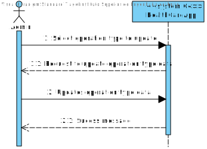
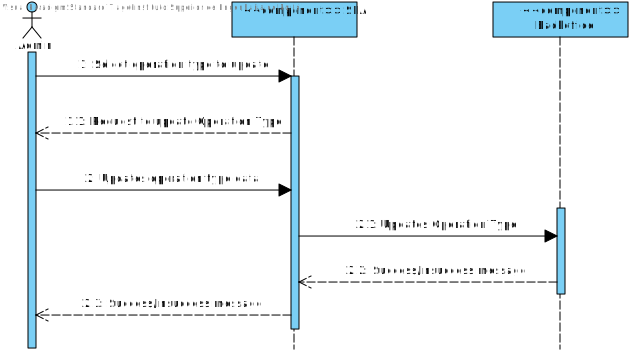
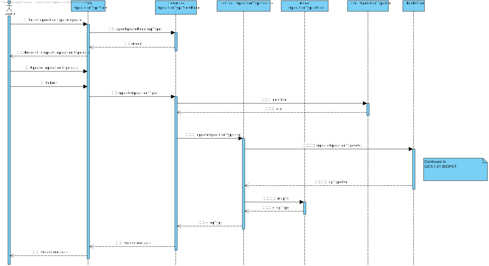

# US 6.2.19

## 1. Context

This task appears in the middle of the project's development, to be able to edit a existing operation type.


## 2. Requirements

**US 6.2.19** As an Admin, I want to edit existing operation types, so that I can update or correct information about the procedure. 

**Acceptance Criteria:**

- Admins can search for and select an existing operation type to edit. 
- Editable fields include operation name, required staff by specialization, and estimated duration. 
- Changes are reflected in the system immediately for future operation requests. 
- Historical data is maintained, but new operation requests will use the updated operation type information.


**Dependencies/References:**

It is also required that the user is registered and logged in as an admin.
The backend component of the US should already be developed.

## 3. Analysis

For this US were considered the requirements specified in the project's description and the client's answers. 
Some relevant answers excerpts are here specified:


```
Q: In a previous answer you stated that "The type of operation is associated with a given specialty".

In another answer you said "a team of 1 doctor with specialization X and one nurse with specialization Y" (regarding the required staff for a said type of operation).

From the specifications document and the additional document with the 10 most common types of operations, we have two specializations: orthopedics and cardiology.

My question is: If the operation type already has a specialization associated, how can we have staff with different specializations?

 

What do you understand by specialization? Is it cardiology/orthopedics? Or anaesthesist/circulating/...

A: the operation is mainly associated with one specialization, but for a specific operation it might require a team with multiple specializations.

cardiology, orthopedics, anaesthesist are specializations that either doctors or nurses can have.

the circulating technician is a different type of medical professional. for now the system doesn't need to support technicians
```

```
Q: Regarding the operation type editions, when does an edition affects an operation request or appoiment?

Let's say the request status is "requested", is the edition applicable to that request? What if the request status is "planned"?

The same for appoitment. I'd assume that operation type editions do not affect completed or cancelled appoitments, but what about the ones with the "scheduled" status?

Can you please clarify this aspect of the system please?

A: surgeries will "point" to the operation type version that is/was in force at the time of scheduling
```

```
Q: Can you clarify? 
"Historical data is maintained, but new operation requests will use the updated operation type information. "

A: 
it means that if an operation type is changed we need to keep track of its changes. For instance,
Operation Type "A" is defined as taking 30 minutes preparation, 1h surgery and 30 minutes cleaning with a team of 1 doctor with specialization X and one nurse with specialization Y
some operations are requested, scheduled and performed based on this definition
after sometime, the hospital changes its procedures and defines the operation type "A" as needing 30 min prep, 30 min. surgery and 30 min. cleaning, with a team of 3 doctors and one nurse.
new operations will be requested, scheduled and performed using this new definition,
however, we need to keep historical data, so that if the admin wants to know the details of an operation in the past, the system must show the operation type as it was defined at the time of the operation request
```

```
Q: 

A: 
```

The following **HTTP requests** will be implemented:
- PUT (to edit a existing operation type)


## 4. Design

This section presents the design adopted to solve the requirement.

### 4.1. Sequence Diagram (Level 1)

 

### 4.2. Sequence Diagram (Level 2)

 

### 4.3. Sequence Diagram (Level 3)

 

### 4.4. Applied Design Patterns

- **Domain Driven Development (DDD):** the focus is the business logic and not the implementation.
- **Data Transfer Object (DTO):** gives an abstraction layer to the domain, so that it's only presented specific information regarding the object.
- **Model View Controller (MVC):** allows the re-usability of components and promotes a more modular approach to the code, making it easier to manage and maintain.
- **Repository pattern:** allows access to data without sharing the details of data storing, like the database connection.
- **Service pattern:** helps keeping high cohesion and low coupling in the code by separating complex business logic from the rest of the system. They also promote reuse, as multiple parts of the system can use the same service to perform common operations.
- **Test Driven Development (TDD):** planning the tests previously to the code gives orientation lines to the development process.
- **Onion Architecture:** concentric layers structure that puts the Domin Model as the core. Promotes modularity, flexibility and testability.
- **Inversion of Control:** the responsability of object creation and dependency management belongs to a framework or external entity, so that the class doesn't need to. Promotes flexibility and decoupling.
- **Dependency Injection:** used to implement inversion of control. The dependencies are injected into a class from the outside.


### 4.5. Tests


The following tests are to be developed:

- the edited operation type must have the same data as the input.
an error message should be displayed when the input is invalid or mandatory.
- a success message should be shown after updating.

Unitary tests to the component will be implemented.

E2E Tests will also check all the US flow, from the user interaction to the backend server.

## 5. Implementation

The implementation of this US is according to the design, as can be seen in the SD and CD presented before.

All commits referred the corresponding issue in GitHub, using the #42 tag, as well as a relevant commit message.

It was implemented in the branch feature/6.2.19-frontend-admin-update-operation-types.

The estimated duration for this US is 10h.

## 6. Integration/Demonstration

To update a new Operation Type, run the Backoffice, Auth and SPA app and then go to the operation type page and click on the update icon in the operation type you wish to update.

## 7. Observations

This work was guided by the project provided in ARQSI classes.