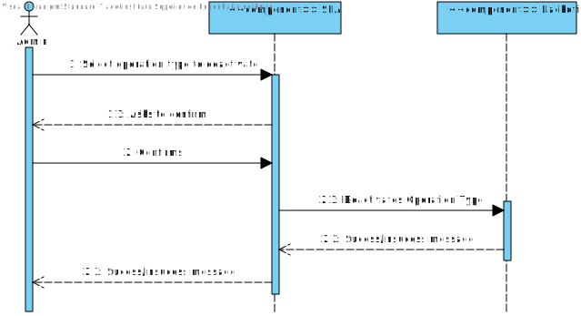
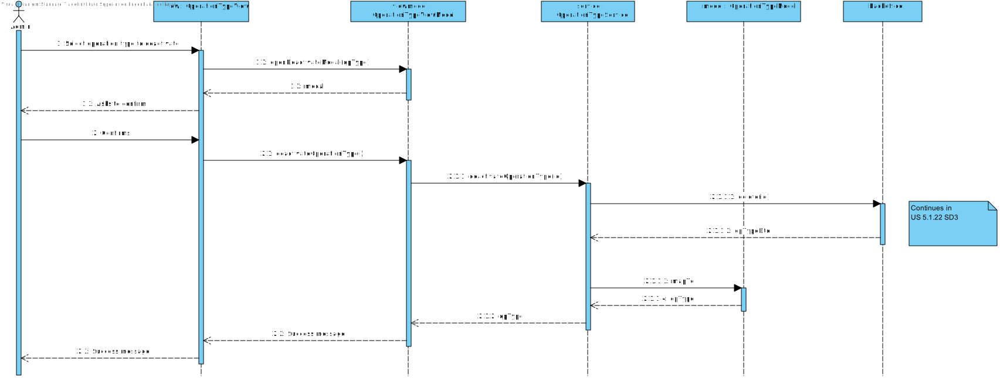

# US 6.2.20

## 1. Context

This task appears in the middle of the project's development, to be able to deactivate a existing operation type.


## 2. Requirements

**US 6.2.20** As an Admin, I want to remove obsolete or no longer performed operation types, so that the system stays current with hospital practices.

**Acceptance Criteria:**
- Admins can search for and mark operation types as inactive (rather than deleting them) to preserve historical records. 
- Inactive operation types are no longer available for future scheduling but remain in historical data. 
- A confirmation prompt is shown before deactivating an operation type. 


**Dependencies/References:**

It is also required that the user is registered and logged in as an admin.
The backend component of the US should already be developed.


## 3. Analysis

For this US were considered the requirements specified in the project's description and the client's answers. 
Some relevant answers excerpts are here specified:


```
"The next one is about removing operation types.

This is how the user story is described, but in the acceptance criteria, the concept of deactivation is introduced. So, is removing actually deactivating the type of operation? Yes, the question is, you need to think in terms of timeline. So, I might have a specific type of operation, say, some kind of leg surgery.

But for some reason, I decided that my hospital would no longer do this type of leg surgery. But I have done it in the past. So, I can't really remove the type of leg surgery.

What I can do is disable this type of operation, so that it is no longer available, so that doctors can no longer order this type of operation. But if I look at the data from the past, and if I have any leg surgery operations, of course I will have the type of leg surgery operation as well. But it is disable.

So, remove, in this sense, is to deactivate. And the last question is more related to the surgery types document."


Q: Is removing an operation type the same as deactivating it?

A: Yes, deactivating makes the operation type unavailable for future use but retains historical data.
```

```
Q: 

A: 
```

```
Q: 

A: 
```

```
Q: 

A: 
```

The following **HTTP requests** will be implemented:
- DELETE (to deactivate a existing operation type)


## 4. Design

This section presents the design adopted to solve the requirement.

### 4.1. Sequence Diagram (Level 1)

 


### 4.2. Sequence Diagram (Level 2)

 


### 4.3. Sequence Diagram (Level 3)

 

### 4.4. Applied Design Patterns

- **Domain Driven Development (DDD):** the focus is the business logic and not the implementation.
- **Data Transfer Object (DTO):** gives an abstraction layer to the domain, so that it's only presented specific information regarding the object.
- **Model View Controller (MVC):** allows the re-usability of components and promotes a more modular approach to the code, making it easier to manage and maintain.
- **Repository pattern:** allows access to data without sharing the details of data storing, like the database connection.
- **Service pattern:** helps keeping high cohesion and low coupling in the code by separating complex business logic from the rest of the system. They also promote reuse, as multiple parts of the system can use the same service to perform common operations.
- **Test Driven Development (TDD):** planning the tests previously to the code gives orientation lines to the development process.
- **Onion Architecture:** concentric layers structure that puts the Domin Model as the core. Promotes modularity, flexibility and testability.
- **Inversion of Control:** the responsability of object creation and dependency management belongs to a framework or external entity, so that the class doesn't need to. Promotes flexibility and decoupling.
- **Dependency Injection:** used to implement inversion of control. The dependencies are injected into a class from the outside.


### 4.5. Tests

The following tests are to be developed:
- a deactivated operation type can't be deactivated again.

Unitary tests to the component will be implemented.

E2E Tests will also check all the US flow, from the user interaction to the backend server.


## 5. Implementation

The implementation of this US is according to the design, as can be seen in the SD and CD presented before.

All commits referred the corresponding issue in GitHub, using the #43 tag, as well as a relevant commit message.

It was implemented in the branch feature/6.2.20-frontend-admin-deactivate-operation-types.

The estimated duration for this US is 10h.


## 6. Integration/Demonstration

To deactivate a Operation Type, run the Backoffice, Auth and SPA app and then go to the Operation Type page and click on the delete icon in the operation type you wish to delete.

## 7. Observations

This work was guided by the project provided in ARQSI classes.